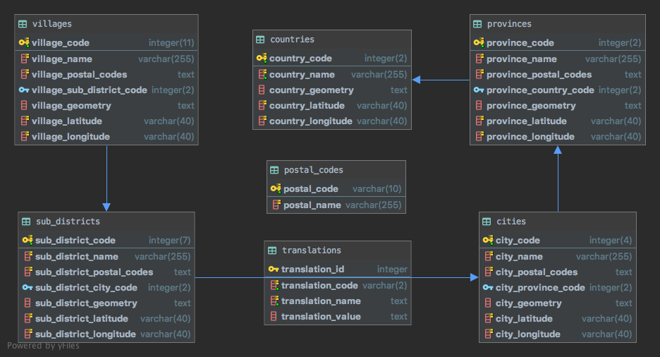

## DATABASE SCHEMA

## NOTE

[records.sqlite.db](records.sqlite.db) does not contains geometry data, just because contains huge points.

Please consider to update manually from [GeoJson](../geojson)
